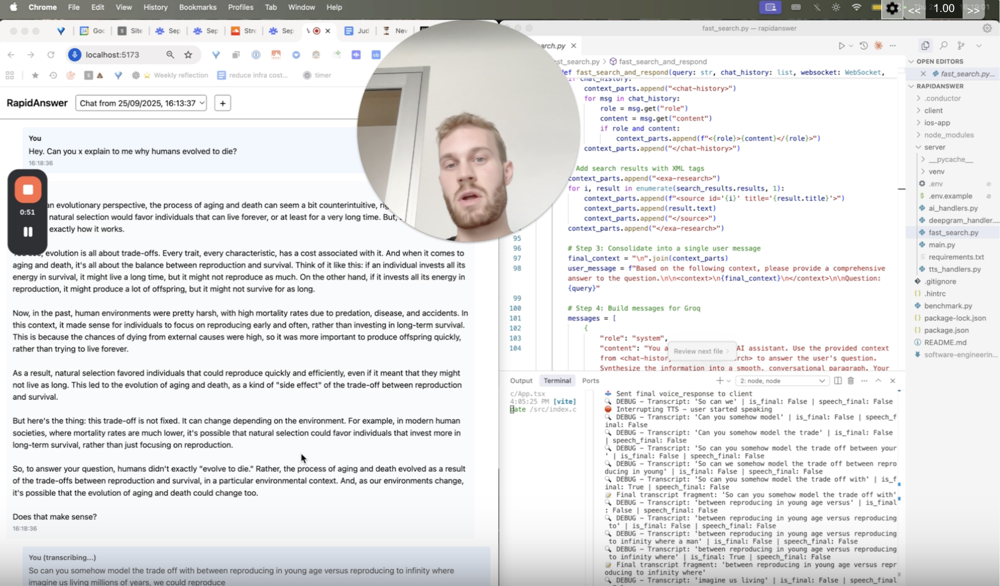

# RapidAnswer

ChatGPT voice mode but on steroids.

RapidAnswer leverages Groq for extremely low-latency AI responses (sub-millisecond latency for the first token and up to 8.5x more tokens per second than OpenAI's GPT-4.1 Nano) and Exa Search for fast, in-depth web knowledge retrieval. This combination allows the application to answer complex questions with greater speed and research depth than typical AI voice chat applications (Grok, ChatGPT, Perplexity, etc.).

Click the image for a demo:

[](https://www.loom.com/share/37f813a0560d4fa2a205d7cc5acb9e42)

## Project Structure

```
rapidanswer/
├── client/          # React + TypeScript frontend
├── server/          # Python FastAPI backend
├── ios-app/         # Swift iOS app (future)
└── README.md
```

## Development

### Setup

1. **Install dependencies**

```bash
npm install
cd client && npm install
cd ../server && pip install -r requirements.txt
```

2. **Set up OpenAI API key**

```bash
cd server
cp .env.example .env
# Edit .env and add your OpenAI API key:
# OPENAI_API_KEY=sk-your-key-here
```

### Running locally

```bash
# Terminal 1: Start Python server (from project root)
cd server && python -m uvicorn main:app --reload --host 0.0.0.0 --port 8000

# Terminal 2: Start React client (from project root)
cd client && npm run dev
```

### Testing the app

1. Open http://localhost:5173 in your browser
2. Allow microphone access when prompted
3. Hold the "Hold to Speak" button and say something
4. Release the button and wait for the AI response

## Tech Stack

- **Client**: React + TypeScript + Vite
- **Server**: Python + FastAPI
- **AI**:
  - **Transcription**: Deepgram (real-time streaming)
  - **Chat**: OpenAI API
  - **Text-to-Speech (TTS)**: OpenAI TTS
  - **Inference Engine**: Groq for low-latency responses
  - **Knowledge Retrieval**: Exa Search
- **iOS**: Swift (future phase)

## WebSocket API

This document outlines the WebSocket communication protocol for the RapidAnswer voice chat application. The server provides a single endpoint at `ws://localhost:8000/ws`.

### Communication Flow

The interaction model supports a continuous, "always-on" conversation with barge-in capabilities.

1.  **Connection**: The client establishes a long-lived WebSocket connection with the server.
2.  **Audio Streaming**: When the user starts a conversation, the client continuously streams raw PCM audio to the server as binary messages.
3.  **Server-Side Transcription**: The server uses Deepgram's streaming transcription. It detects pauses in the user's speech to identify the end of an utterance.
4.  **Turn Handling**: When an utterance is finalized, the server sends the transcript to the AI for a response. The transcript accumulates if the user continues speaking before the AI responds.
5.  **Barge-In (Interruption)**: If the user starts speaking while the AI is responding (detected via interim transcripts), the server immediately sends a `stop_audio_playback` message to halt client-side TTS playback. Complete utterances cancel the in-progress AI/TTS task on the server side.
6.  **Response Streaming**: The server streams the AI's text and synthesized audio back to the client in real-time.
7.  **End of Session**: The user can explicitly end the session, which sends a `user_audio_end` message and closes the connection.

---

### Client-to-Server Messages

#### 1. Binary Audio Chunks

- **Type**: `Binary`
- **Content**: Raw PCM audio data (16-bit, 16kHz, single-channel).
- **When**: Sent continuously while the conversation is active.

#### 2. User Audio End

- **Type**: `Text` (JSON)
- **When**: Sent when the user explicitly stops the conversation.
- **Example**: `{"type": "user_audio_end"}`

---

### Server-to-Client Messages

#### 1. Interim Transcription

- **`type`**: `"interim_transcription"`
- **`text`**: `string`

#### 2. AI Response Stream (Text)

- **`type`**: `"ai_response_stream"`
- **`content`**: `string`
- **`is_complete`**: `boolean`

#### 3. Audio Stream (PCM)

- **`type`**: `"audio_stream_pcm"`
- **`pcm_chunk`**: `string` (base64-encoded)
- **`sample_rate`**: `number`
- **`channels`**: `number`

#### 4. Final Voice Response

- **`type`**: `"voice_response"`
- **`transcription`**: `string`
- **`ai_response`**: `string`

#### 5. Stop Audio Playback

- **`type`**: `"stop_audio_playback"`
- **When**: Sent during a barge-in to immediately halt client-side audio. Triggered when the user starts speaking (detected via interim transcripts) while the AI is still talking.

#### 6. Error

- **`type`**: `"error"`
- **`message`**: `string`
